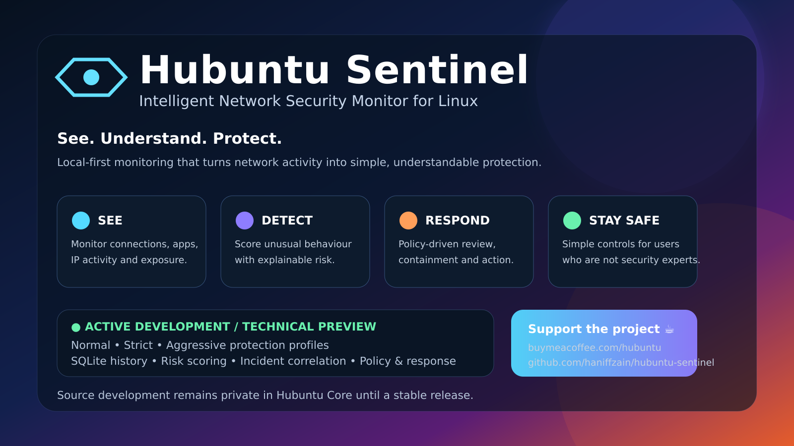

<p align="center">
  
</p>

# Hubuntu Sentinel

**Simple network security monitoring for Hubuntu Linux.**

Hubuntu Sentinel watches network activity, connects visible traffic to applications when possible, highlights unusual behaviour, and helps the user understand what needs attention without forcing them to read highly technical security data.

> **Current status:** Active Development / Technical Preview

## What it is

Hubuntu Sentinel is currently positioned as an **intelligent network security monitor with host-awareness and automated protection logic**.

Its goal is simple:

**See what is happening → understand the risk → respond safely.**

The interface is intentionally kept compact so non-technical users can understand states such as:

- **Safe**
- **Needs Review**
- **Blocked**
- **Protection Active**
- **Low / Medium / High Risk**

Detailed process, IP, rule, score, and incident information remains available when deeper investigation is needed.

## Current capabilities

- TCP/UDP connection monitoring
- IP and local/public activity classification
- application/process attribution when available
- public-listener and unusual-activity detection
- Normal / Strict / Aggressive protection profiles
- SQLite event history
- explainable risk scoring
- incident correlation
- policy-driven decisions
- response planning and protection controls
- local audit history
- emergency network isolation control

## How Sentinel is evolving

```text
Network Activity
      ↓
Observe
      ↓
Remember (SQLite)
      ↓
Risk Scoring
      ↓
Incident Correlation
      ↓
Policy Decision
      ↓
Response
      ↓
Simple User Console
```

Hubuntu Sentinel is being developed toward a broader Linux endpoint-security architecture, but this repository does **not** claim that the current Technical Preview is a complete EDR/XDR platform.

## Public repository policy

This repository is the **public product and project-information home** for Hubuntu Sentinel.

During active development, source code is intentionally kept in the private Hubuntu Core development repository. This public repository contains product information, project status, roadmap, licensing information, screenshots and promotional assets only.

Source publication or binary release will be decided when Sentinel reaches an appropriate stable milestone.

## Project pages

- [Product Overview](PRODUCT-OVERVIEW.md)
- [Development Status](STATUS.md)
- [Roadmap](ROADMAP.md)
- [Licensing](LICENSING.md)

## Privacy principle

Sentinel follows a **local-first** direction. Core monitoring history and analysis are designed to remain on the endpoint. Future cloud or threat-intelligence integrations should be optional rather than required for basic protection.

## Support Hubuntu Sentinel

If you would like to support continued development:

[☕ **Buy Me a Coffee — Hubuntu**](https://buymeacoffee.com/hubuntu)

## Development relationship

```text
haniffzain/hubuntu-core
└── private Sentinel development and integration

haniffzain/hubuntu-sentinel
└── public product information and future releases
```

---

**Hubuntu Sentinel**  
*See. Understand. Protect.*
